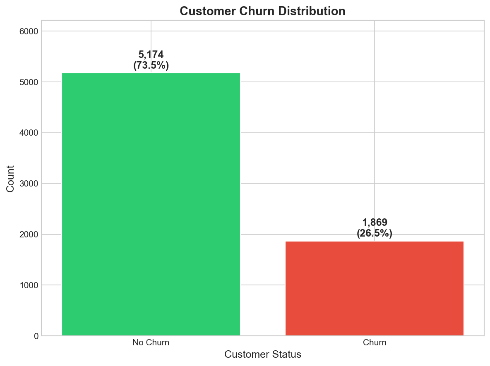
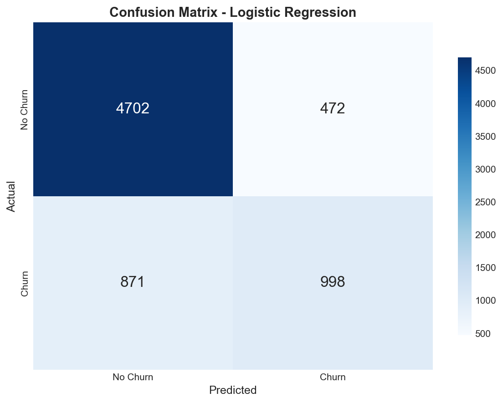
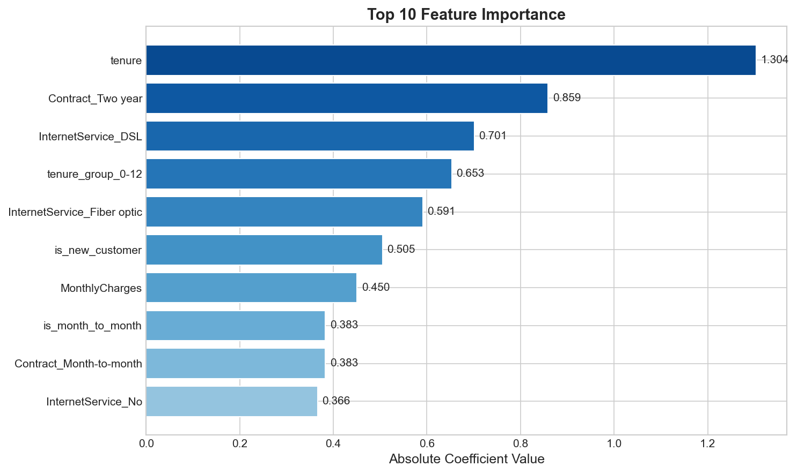
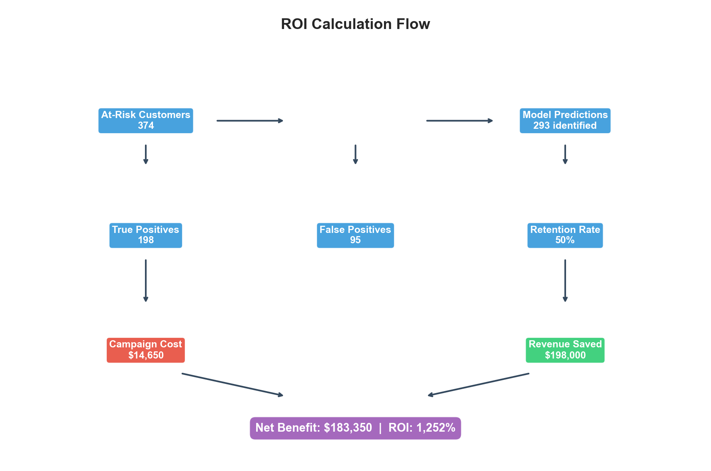

# Customer Churn Prediction & Personalized Marketing Assistant


## Project Overview

An end-to-end machine learning project for predicting customer churn and generating personalized retention marketing offers. It combines traditional ML models for churn probability prediction with Google's Gemini API for dynamic, context-aware marketing messages. The solution is accessible via both a FastAPI web API and a Command Line Interface (CLI).

## Key Results

| Metric | Value |
|--------|-------|
| Model Accuracy | 80.8% |
| ROC-AUC Score | 0.847 |
| Precision | 67.6% |
| Recall | 52.9% |
| Estimated ROI | 1,252% |

### Model Limitations

- **Training Data**: Trained on US telecom customer data; may require retraining for other markets or industries
- **Class Imbalance**: Dataset has 26.5% churn rate - recall on churning customers is 52.9%
- **Feature Drift**: Model performance may degrade if customer behavior patterns change significantly over time
- **Static Predictions**: Model provides point-in-time predictions; not designed for time-series forecasting

### Visualizations

<p align="center">
  
  
</p>

<p align="center">
  
  
</p>

## Features

- **Churn Prediction:** Logistic Regression model predicts customer churn probability based on customer attributes
- **Personalized Offers (Gemini AI):** Generates tailored marketing offers to retain at-risk customers
- **Scalable API:** FastAPI endpoint (`/predict`) for real-time predictions and offer generation
- **Interactive CLI:** Command-line interface for quick predictions and testing
- **Secure API Key Handling:** Uses `python-dotenv` for secure API key management
- **Containerized Deployment:** Dockerfile provided for consistent deployment

---

## Quick Start

**Just want to see the results?**

1. Clone and setup:
```bash
git clone https://github.com/yoonjae0402/customer-churn-analysis.git
cd customer-churn-analysis
pip install -r app/requirements.txt
```

2. Download data from [Kaggle Telco Customer Churn](https://www.kaggle.com/datasets/blastchar/telco-customer-churn)

3. Run notebooks in order:
```bash
jupyter notebook
# Open notebooks/01_exploration.ipynb
```

Each notebook is self-contained with detailed markdown explanations.

---

## Prerequisites

- **Python**: 3.9 or higher
- **RAM**: 4GB minimum, 8GB recommended
- **Disk Space**: ~500MB for dataset and dependencies
- **Knowledge**: Basic understanding of:
  - Machine learning concepts
  - Pandas and scikit-learn
  - Jupyter notebooks
- **Tools**:
  - Jupyter Notebook or JupyterLab
  - Git for version control

---

## Architecture

The system integrates predictive analytics with generative AI, providing a seamless flow from raw customer data to actionable insights.

```mermaid
graph TD
    A[User Request (API / CLI)] --> B(FastAPI Endpoint / CLI Input)
    B --> C{Pydantic Validation}
    C --> D{Preprocessing Module}
    D --> E[Feature Engineered Data]
    E --> F(ML Churn Prediction Model)
    F --> G[Churn Probability]
    G --> H(Gemini API: Offer Generation)
    H --> I[Personalized Marketing Offer]
    G & I --> J[Final Response / CLI Output]
```

**Flow Description:**
1. **User Request** originates from either the FastAPI `/predict` endpoint or the CLI
2. Input data undergoes **Pydantic Validation** to ensure correctness
3. The **Preprocessing Module** transforms raw data (feature engineering, encoding, scaling)
4. The **ML Churn Prediction Model** calculates the **Churn Probability**
5. **Gemini AI** generates a **Personalized Marketing Offer** based on customer profile and risk
6. Results are returned via API response or CLI output

---

## Technical Highlights

### Why Combine LLM with ML?

- **ML for Quantitative Precision:** The Logistic Regression model identifies patterns in structured customer data to accurately quantify churn risk with a precise probability score

- **LLM for Qualitative Nuance:** While the ML model tells us *if* and *how likely* a customer will churn, Gemini translates this into actionable retention strategies by:
  - Contextualizing customer services, contract terms, and demographics
  - Personalizing offers that address customer-specific needs
  - Recommending specific discounts, upgrades, or support options

### Asynchronous Processing

Built with Python's `asyncio` and FastAPI for efficient request handling:
- Non-blocking I/O for external API calls
- Handles concurrent requests efficiently
- Singleton pattern for model loading (one-time disk I/O)

---

## Demo

### Sample Prediction
```python
# Example: Predict churn for a customer
customer_data = {
    'tenure': 3,
    'MonthlyCharges': 85.50,
    'Contract': 'Month-to-month',
    'InternetService': 'Fiber optic',
    'OnlineSecurity': 'No',
    'TechSupport': 'No',
    # ... other features
}

# Output:
# Churn Probability: 78%
# Risk Level: HIGH - Immediate Intervention Needed
# Recommended Action: Offer 6-month contract discount
```

See full demo in [`notebooks/04_evaluation.ipynb`](notebooks/04_evaluation.ipynb)

---

## Installation

### 1. Clone the repository
```bash
git clone https://github.com/yoonjae0402/customer-churn-analysis.git
cd customer-churn-analysis
```

### 2. Create and activate a virtual environment
```bash
python3 -m venv venv

# Mac/Linux
source venv/bin/activate

# Windows
venv\Scripts\activate
```

### 3. Install Python dependencies
```bash
pip install -r app/requirements.txt
```

### 4. Set up Gemini API Key
Get your API key from [Google AI Studio](https://aistudio.google.com/apikey).

Create a `.env` file in the `app/` directory:
```bash
# Mac/Linux
echo "GEMINI_API_KEY=YOUR_API_KEY_HERE" > app/.env

# Windows (PowerShell)
"GEMINI_API_KEY=YOUR_API_KEY_HERE" | Out-File -FilePath app\.env
```

### 5. Prepare ML Artifacts
```bash
cd app && python3 save_pipeline.py
```

---

## Usage

### FastAPI (Web API)

```bash
cd app && uvicorn main:app --reload --host 0.0.0.0 --port 8000
```

Access Swagger UI at `http://localhost:8000/docs`

**Example API Call:**
```bash
curl -X POST "http://localhost:8000/predict" \
  -H "Content-Type: application/json" \
  -d '{
    "gender": "Female",
    "SeniorCitizen": 0,
    "Partner": "Yes",
    "Dependents": "No",
    "tenure": 12,
    "PhoneService": "Yes",
    "MultipleLines": "No",
    "InternetService": "Fiber optic",
    "OnlineSecurity": "No",
    "OnlineBackup": "Yes",
    "DeviceProtection": "No",
    "TechSupport": "No",
    "StreamingTV": "Yes",
    "StreamingMovies": "No",
    "Contract": "Month-to-month",
    "PaperlessBilling": "Yes",
    "PaymentMethod": "Electronic check",
    "MonthlyCharges": 89.90,
    "TotalCharges": 1078.80
  }'
```

**Example Response:**
```json
{
  "churn_probability": 0.78,
  "marketing_offer": "We noticed you've been with us for a year now...",
  "metadata": {
    "model_version": "1.0.0",
    "latency_ms": 1250.5
  }
}
```

### CLI (Command Line Interface)

```bash
cd app && python3 main.py --cli \
    --gender Female \
    --senior_citizen 0 \
    --partner Yes \
    --dependents No \
    --tenure 12 \
    --phone_service Yes \
    --multiple_lines Yes \
    --internet_service "Fiber optic" \
    --online_security No \
    --online_backup Yes \
    --device_protection No \
    --tech_support No \
    --streaming_tv Yes \
    --streaming_movies No \
    --contract Month-to-month \
    --paperless_billing Yes \
    --payment_method "Electronic check" \
    --monthly_charges 89.90 \
    --total_charges 1078.80
```

*Note: `--total_charges` is optional. If omitted, it will be calculated from `monthly_charges * tenure`.*

### Docker Deployment

**Build the image:**
```bash
docker build -f app/Dockerfile -t customer-churn-app .
```

**Run (API Mode):**
```bash
docker run -p 8000:8000 \
    -e GEMINI_API_KEY="YOUR_API_KEY_HERE" \
    customer-churn-app
```

**Run (CLI Mode):**
```bash
docker run \
    -e GEMINI_API_KEY="YOUR_API_KEY_HERE" \
    customer-churn-app python3 main.py --cli \
    --gender Male \
    --tenure 1 \
    --monthly_charges 45.0 \
    # ... other arguments
```

---

## Project Structure

```
customer-churn-analysis/
├── app/                          # Application code
│   ├── main.py                   # FastAPI app and CLI
│   ├── save_pipeline.py          # Model export script
│   ├── Dockerfile                # Container configuration
│   ├── requirements.txt          # Python dependencies
│   ├── data/                     # Data files
│   │   ├── raw/                  # Original dataset
│   │   └── processed/            # Engineered features
│   └── models/                   # Trained models
│       ├── churn_model.pkl       # Production model
│       ├── scaler.pkl            # Feature scaler
│       └── model_comparison.csv  # Model benchmarks
├── notebooks/                    # Jupyter notebooks
│   ├── 01_exploration.ipynb      # Data exploration
│   ├── 02_feature_engineering.ipynb
│   ├── 03_modeling.ipynb
│   └── 04_evaluation.ipynb
├── tests/                        # Unit and integration tests
│   ├── test_model.py             # Model loading and prediction tests
│   ├── test_api.py               # API endpoint tests
│   └── conftest.py               # Pytest configuration
├── src/                          # Reusable utility modules
│   ├── data_loader.py            # Data loading utilities
│   ├── preprocessing.py          # Feature engineering
│   ├── model.py                  # Model training functions
│   └── evaluation.py             # Evaluation metrics
├── docs/                         # Documentation
│   ├── data_dictionary.md        # Feature descriptions
│   ├── methodology.md            # Technical approach
│   ├── business_case.md          # ROI analysis
│   └── deployment.md             # Deployment guide
├── reports/                      # Analysis outputs
│   ├── figures/                  # Visualizations
│   ├── business_impact.csv       # ROI calculations
│   └── customer_risk_segments.csv
├── requirements-dev.txt          # Development dependencies
├── pytest.ini                    # Pytest configuration
└── README.md
```

---

## Troubleshooting

### Common Issues

**"ModuleNotFoundError"**
```bash
pip install -r app/requirements.txt --upgrade
```

**"Dataset not found"**
- Ensure CSV is in `app/data/raw/` folder
- Check filename matches exactly: `telco_churn.csv`

**"Kernel dies when running notebook"**
- Increase available RAM
- Restart Jupyter kernel
- Run cells individually instead of "Run All"

**"Model performance differs from README"**
- Random seed variation is normal (±2-3%)
- Ensure you're using the same train/test split

**"GEMINI_API_KEY not found"**
- Create `.env` file in `app/` directory
- Verify API key is valid at [Google AI Studio](https://aistudio.google.com/apikey)

**"churn_model.pkl not found"**
- Run `cd app && python3 save_pipeline.py` to generate model artifacts

Need help? [Open an issue](https://github.com/yoonjae0402/customer-churn-analysis/issues)

---

## Testing

Run the test suite to verify the installation:

```bash
# Install dev dependencies
pip install -r requirements-dev.txt

# Run all tests
pytest tests/ -v

# Run with coverage report
pytest tests/ -v --cov=app --cov-report=html
```

---

## Documentation

| Document | Description |
|----------|-------------|
| [Data Dictionary](docs/data_dictionary.md) | Feature descriptions and data schema |
| [Methodology](docs/methodology.md) | Technical approach and model selection |
| [Business Case](docs/business_case.md) | ROI calculation and business value |
| [Deployment Guide](docs/deployment.md) | Production deployment guidelines |

---

## Contributing

Contributions are welcome! Please feel free to open issues or submit pull requests.

1. Fork the repository
2. Create a feature branch (`git checkout -b feature/amazing-feature`)
3. Commit your changes (`git commit -m 'Add amazing feature'`)
4. Push to the branch (`git push origin feature/amazing-feature`)
5. Open a Pull Request

---

## Author

**Yunjae Jung**
Data Science Student | Machine Learning Enthusiast

- LinkedIn: [linkedin.com/in/yunjae-jung-99a13b221](https://www.linkedin.com/in/yunjae-jung-99a13b221/)
- GitHub: [@yoonjae0402](https://github.com/yoonjae0402)
- Email: yoonjae0402@gmail.com
- Syracuse University - Computer Science, Class of 2026

**Open to**: Summer 2026 Data Science Internships

---

## License

This project is licensed under the MIT License - see the [LICENSE](LICENSE) file for details.
