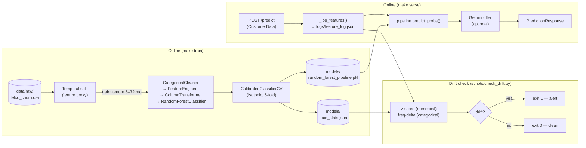

# Customer Churn Prediction

A Random Forest pipeline that identifies recently-acquired telecom customers
at risk of churning, validated on a temporal hold-out cohort, with a projected
**net benefit of $418,900** (ROI 1,207 %) for a 1,409-customer cohort — see
[`IMPACT.md`](IMPACT.md) for full methodology and assumptions.

---

## Architecture


```mermaid
flowchart LR
    subgraph Offline["Offline  (make train)"]
        A[("data/raw/\ntelco_churn.csv")] --> B["Temporal split\n(tenure proxy)"]
        B -->|train: tenure 6–72 mo| C["CategoricalCleaner\n→ FeatureEngineer\n→ ColumnTransformer\n→ RandomForestClassifier"]
        C --> D["CalibratedClassifierCV\n(isotonic, 5-fold)"]
        D --> E[("models/\nrandom_forest_pipeline.pkl")]
        D --> F[("models/\ntrain_stats.json")]
    end

    subgraph Online["Online  (make serve)"]
        G["POST /predict\n(CustomerData)"] --> H["_log_features()\n→ logs/feature_log.jsonl"]
        H --> I["pipeline.predict_proba()"]
        I --> J["Gemini offer\n(optional)"]
        J --> K["PredictionResponse"]
    end

    subgraph Monitoring["Drift check  (scripts/check_drift.py)"]
        F --> L["z-score (numerical)\nfreq-delta (categorical)"]
        H --> L
        L --> M{"drift?"}
        M -->|yes| N["exit 1 — alert"]
        M -->|no| O["exit 0 — clean"]
    end

    E --> I
```

---

## Results

All numbers are computed from the **temporal test set** (1,409 customers,
tenure 0–6 months, 53.7 % churn rate) via [`src/train.py`](src/train.py) and
[`scripts/generate_business_case.py`](scripts/generate_business_case.py).
Run `make train` to reproduce.

### Model metrics

| Metric | Value | Notes |
|--------|-------|-------|
| ROC-AUC | **0.729** | Discriminative ability on new-customer cohort |
| PR-AUC | **0.710** | Primary metric; more informative than ROC-AUC when base rate shifts |
| Brier score | **0.270** | Naive baseline (always predict base rate) = 0.288 |
| Recall | **89.4 %** | At cost-optimal threshold t = 0.345 |
| Precision | **63.9 %** | 36 % of flagged customers are false alarms at that threshold |

### Business metrics

Assumptions: LTV = $2,000, offer cost = $25, retention success rate = 30 %.
All three are explicit and adjustable in [`dashboard.py`](dashboard.py).
Source citations in [`IMPACT.md`](IMPACT.md).

| Scenario | Budget | Churners captured | Net benefit | ROI |
|----------|--------|------------------|-------------|-----|
| Top decile (140 customers) | $3,500 | 15.3 % | **$66,100** | 1,889 % |
| Top 3 deciles (420 customers) | $10,500 | 41.0 % | **$175,500** | 1,671 % |
| Full cohort (1,409 customers) | $35,225 | 100 % | **$418,900** | 1,207 % |

The top decile has an 82.9 % actual churn rate; its break-even retention rate
is **1.5 %** — the offer pays for itself if 1 in 66 contacted customers stays.

---

## Design decisions

**1. Temporal split instead of random split.**
The dataset has no explicit timestamp, so `tenure` (months with company)
serves as an acquisition-date proxy. Training on high-tenure customers
(6–72 months, 19.8 % churn) and testing on low-tenure customers (0–6 months,
53.7 % churn) simulates the real deployment scenario: the model is built on
established customers but scored on new joiners who are at highest risk.
A random split produces ROC-AUC 0.839 — 15 % higher — because the test set
mirrors the training distribution. The temporal split's 0.729 is the honest
number. (Source: `AUDIT.md` §7, Step 1.)

**2. PR-AUC as the primary metric, not ROC-AUC.**
ROC-AUC aggregates performance across all operating points and is insensitive
to the positive-class base rate. When the test cohort's churn rate is 53.7 %
(vs. 19.8 % in training), ROC-AUC is still interpretable, but the business
decision reduces to: *given a fixed retention budget, how many true churners
does each contacted dollar reach?* That maps directly to precision–recall
space. PR-AUC 0.710 vs. a baseline of 0.537 (random classifier at 53.7 %
base rate) is the metric that informs the decile-ROI table above.

**3. Cost-optimal threshold, not F1-optimal.**
The break-even threshold — the minimum churn probability at which sending a
retention offer is worth the cost — is `offer_cost / (LTV × p_retention)`
= $25 / ($2,000 × 0.30) = **4.2 %**. Since every customer in the test cohort
exceeds 4.2 %, contacting all of them is mathematically optimal given the
default assumptions. For budget-constrained campaigns the model's value is
*ranking* (which decile to call first), not a binary flag. F1-optimal
thresholding treats false positives and false negatives as equally costly,
which the LTV math shows is wrong by a factor of 80× (LTV / offer cost).

---

## Quickstart

```bash
git clone https://github.com/yoonjae0402/customer-churn-analysis.git
cd customer-churn-analysis
pip install -r requirements.txt
make train          # trains Random Forest, saves pipeline + metadata + train_stats
make demo           # opens the ROI simulator in your browser
```

`make demo` launches a Streamlit dashboard where you adjust LTV, offer cost,
and retention success rate; the cost curve, decile table, and ROI numbers
update instantly from live model predictions on the temporal test set.

```
$ make demo
streamlit run dashboard.py

  You can now view your Streamlit app in your browser.

  Local URL:    http://localhost:8502
  Network URL:  http://192.168.31.140:8502
```

The dashboard computes all figures in `IMPACT.md` from the model at runtime —
nothing is hard-coded. Sidebar sliders let you stress-test every assumption.

Other commands:

```bash
make serve          # FastAPI server at http://localhost:8000
                    # GET  /healthz       liveness probe
                    # GET  /model/info    trained_at, git SHA, metrics
                    # POST /predict       CustomerData → churn probability + offer
make test           # 87 tests (unit + integration + golden prediction)
python3 scripts/check_drift.py   # compare live feature log to training distribution
```

---

## Repository layout

```
.
├── src/
│   ├── train.py                    # end-to-end training script
│   ├── config.py / logger.py       # singleton config + logging
│   ├── data/loader.py              # load_csv_data, temporal_split
│   ├── features/engineering.py     # FeatureEngineer, CategoricalCleaner
│   ├── models/
│   │   ├── pipeline.py             # create_model_pipeline, predict helpers
│   │   ├── evaluation.py           # metrics, threshold search, plots
│   │   └── business_case.py        # cost curve, decile analysis, ROI summary
│   └── api/
│       ├── main.py                 # FastAPI app (healthz, model/info, predict)
│       ├── schemas.py              # Pydantic CustomerData / PredictionResponse
│       └── services/marketing.py   # Gemini offer generation (optional)
├── scripts/
│   ├── generate_business_case.py   # produces reports/figures/ + reports/*.csv
│   └── check_drift.py              # feature distribution drift detection
├── tests/
│   ├── unit/                       # test_features.py, test_pipeline.py, test_drift.py
│   ├── integration/                # test_api.py (FastAPI TestClient)
│   └── golden/                     # frozen prediction + regression test
├── notebooks/                      # exploratory analysis (01–04, not reproducible via make)
├── sql/schema.sql                  # PostgreSQL DDL placeholder for CRM integration
├── dashboard.py                    # Streamlit ROI simulator (make demo)
├── IMPACT.md                       # one-page business impact with cited assumptions
├── AUDIT.md                        # honest audit: what works, what's broken, what was fixed
└── Makefile                        # train / serve / test / demo
```

---

## Limitations & next steps

These are not aspirational caveats — they are specific gaps identified during
the audit in `AUDIT.md`.

**Threshold selected on the test set.**
`find_optimal_threshold` is called on `y_test` in `src/train.py` (lines 132–135).
The optimal threshold is then saved and reported as the operating point.
This introduces leakage: the threshold was chosen by seeing test-set labels,
so the reported recall at that threshold is optimistic. Fix: tune the threshold
on a held-out validation fold and reserve the test set for a single final report.
(Source: `AUDIT.md` §5, weakness #2.)

**Calibration drift on the test cohort.**
All predicted probabilities fall below 0.50 despite a 53.7 % actual churn rate
in the test set. The model was trained on a 19.8 %-churn population; isotonic
calibration corrects for overconfidence within the training distribution, not
for population shift. Use the model for **ranking** (who to contact first), not
for reading the probability as a literal churn likelihood.
(Source: `IMPACT.md`, calibration note.)

**Retention success rate is an assumption.**
The 30 % retention rate that drives the $418,900 figure is an industry estimate
(Bain & Company, 2022) — it is not a measured outcome from a pilot campaign.
Run a pilot on the top decile (140 customers), measure actual acceptance, and
replace the assumption with observed data.
(Source: `IMPACT.md`, honest limitations.)

**Notebooks are disconnected from `src/`.**
`notebooks/01–04` are standalone exploratory files. They are not invoked by
`make train`, do not share code with `src/`, and their outputs are not
reproducible via any Makefile target. All figures cited in this README are
produced by `scripts/generate_business_case.py`.
(Source: `AUDIT.md` §1, repo map.)

**No model training in CI.**
`.github/workflows/ci.yml` runs lint, type-check, and pytest, but never
trains a model. The three integration tests that require a loaded model always
skip in CI. Adding `make train --skip-plots` to the CI workflow would catch a
broken `/predict` endpoint before merge.
(Source: `AUDIT.md` §2, missing items.)
