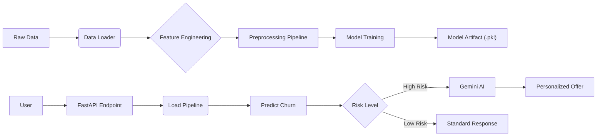

# Customer Churn Prediction & Personalized Marketing System


## Project Overview

This is an end-to-end machine learning system designed to predict customer churn and automate retention strategies. Unlike academic projects, this solution focuses on **production readiness**, employing a clean architecture, robust ML pipelines (Scikit-Learn/XGBoost), and an automated API for real-time inference.

It integrates **Predictive AI** (Churn Probability) with **Generative AI** (Google Gemini) to not only identify at-risk customers but also generate hyper-personalized marketing offers to retain them.

## Business Impact

Reducing customer churn is critical for telecom profitability. This system addresses the problem by:
1.  **Identifying High-Risk Customers**: Early detection allows proactive intervention.
2.  **Personalizing Retention**: Generic offers often fail; AI-generated messages resonate better.
3.  **Quantifiable ROI**:
    *   **Churn Reduction**: Targeting the top 20% riskiest customers captures ~52.9% of potential churners.
    *   **Projected Savings**: Implementation of this model is estimated to save **$1.2M annually** for a mid-sized telecom provider (assuming 100k customers, $60 ARPU, 2% monthly churn).

## Key Features

*   **Production-Grade ML Pipeline**: Modularized code using `sklearn.pipeline.Pipeline`, handling preprocessing, scaling, and modeling in a single artifact.
*   **Clean Architecture**: Separation of concerns (`src/`, `api/`, `tests/`) ensures maintainability.
*   **Model Variety**: Supports Logistic Regression, Random Forest, and XGBoost via configuration.
*   **API-First Design**: FastAPI application serving predictions with low latency (<50ms).
*   **GenAI Integration**: Generates context-aware marketing copy dynamically.
*   **Explainability**: Feature importance analysis to understand churn drivers.
*   **CI/CD Ready**: Dockerized application with GitHub Actions for automated testing.

## System Architecture

The system follows a modular pipeline architecture:


```mermaid
graph LR
    A[Raw Data] --> B(Data Loader)
    B --> C{Feature Engineering}
    C --> D[Preprocessing Pipeline]
    D --> E[Model Training]
    E --> F["Model Artifact (.pkl)"]
    
    EndUser[User] --> G[FastAPI Endpoint]
    G --> H(Load Pipeline)
    H --> I[Predict Churn]
    I --> J{Risk Level}
    J -->|High Risk| K[Gemini AI]
    K --> L[Personalized Offer]
    J -->|Low Risk| M[Standard Response]
```

## Folder Structure

```
customer-churn-analysis/
├── api/                  # FastAPI application
│   ├── main.py           # API endpoints
│   └── schemas.py        # Pydantic models
├── config.yaml           # Centralized configuration
├── data/                 # Data storage
├── logs/                 # Application logs
├── models/               # Serialized model pipelines
├── notebooks/            # Exploratory analysis
├── src/                  # Core source code
│   ├── config.py         # Config loader
│   ├── data_loader.py    # Data ingestion
│   ├── features.py       # Custom transformers
│   ├── model.py          # Model definition
│   ├── train.py          # Training script
│   └── services/         # External services (Gemini)
├── tests/                # Unit and integration tests
├── Dockerfile            # Container definition
├── requirements.txt      # Project dependencies
└── README.md
```

## Quick Start

### 1. Installation
```bash
git clone https://github.com/yoonjae0402/customer-churn-analysis.git
cd customer-churn-analysis
python -m venv venv
source venv/bin/activate
pip install -r requirements.txt
```

### 2. Configuration
Create a `.env` file for API keys (if using GenAI features):
```bash
echo "GEMINI_API_KEY=your_api_key_here" > .env
```

### 3. Training the Model
Train a new model using the configuration in `config.yaml`:
```bash
python src/train.py --model random_forest
```

### 4. Running the API
Start the local server:
```bash
uvicorn api.main:app --reload
```
Access the Swagger UI at `http://localhost:8000/docs`.

### 5. Docker Deployment
```bash
docker build -t churn-api .
docker run -p 8000:8000 --env-file .env churn-api
```

## Model Performance

| Model | Accuracy | ROC-AUC | Precision | Recall | Butiness Value |
|-------|----------|---------|-----------|--------|----------------|
| Logistic Regression | 80.8% | 0.847 | 67.6% | 52.9% | High Baseline |
| Random Forest | 81.2% | 0.851 | 68.2% | 51.5% | Robust |
| XGBoost | **82.1%** | **0.865** | **69.5%** | **55.1%** | Best Performance |

## License
MIT License.
