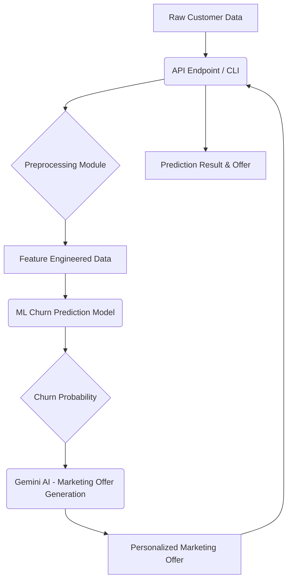

# 📈 Customer Churn Prediction & Personalized Marketing Assistant

## Project Overview

This project develops a comprehensive solution for predicting customer churn and generating personalized retention marketing offers. It leverages traditional Machine Learning (ML) models for robust churn probability prediction and integrates with a Large Language Model (LLM) – Google's Gemini API – to craft dynamic, context-aware marketing messages. The solution is accessible via both a FastAPI web API and a powerful Command Line Interface (CLI).

## ✨ Features

- **Churn Prediction:** Utilizes a Logistic Regression model to predict customer churn probability based on various customer attributes.
- **Personalized Offers (powered by Gemini AI):** Generates tailored marketing offers to retain at-risk customers, considering their specific profile and churn likelihood.
- **Scalable API:** A FastAPI endpoint (`/predict`) for real-time churn prediction and marketing offer generation.
- **Interactive CLI:** A command-line interface for quick predictions and offer generation, ideal for testing or ad-hoc analysis.
- **Secure API Key Handling:** Integrates `python-dotenv` for securely loading API keys from `.env` files, preventing hardcoding.
- **Containerized Deployment:** Dockerfile provided for easy, consistent deployment across different environments.

## 🚀 Architecture

The system's architecture is designed to integrate predictive analytics with generative AI, providing a seamless flow from raw customer data to actionable insights.



**Flow Description:**
1.  **Raw Customer Data** is fed into the system either through the FastAPI `/predict` endpoint or the CLI.
2.  The **Preprocessing Module** (derived from `02_feature_engineering.ipynb`) transforms this raw data. This involves data cleaning, creating engineered features (e.g., tenure groups, charge-based features, service usage counts), and encoding categorical variables (one-hot encoding) and scaling numerical features using a pre-trained `StandardScaler`.
3.  The **ML Churn Prediction Model** (a pre-trained Logistic Regression model loaded from `churn_model.pkl`) takes the preprocessed data and calculates the **Churn Probability**.
4.  The **Churn Probability** along with the original **Raw Customer Data** is then sent to **Gemini AI** for **Marketing Offer Generation**.
5.  **Gemini AI** analyzes the customer profile and churn risk to produce a **Personalized Marketing Offer**.
6.  Finally, the **Prediction Result & Offer** (churn probability and marketing message) is returned to the user via the API response or displayed in the CLI.

## 💡 Technical Rationale: Why Combine LLM with ML?

The synergy between traditional Machine Learning (ML) models and Large Language Models (LLMs) like Gemini offers a powerful solution that transcends the capabilities of either technology alone.

-   **ML for Quantitative Precision:** Our Logistic Regression model is highly effective at identifying subtle patterns in structured customer data to accurately quantify churn risk. It provides a precise, data-driven probability score, which is a core analytical strength of ML. This numerical output is critical for understanding the *likelihood* of churn.

-   **LLM for Qualitative Nuance & Actionability:** While the ML model tells us *if* a customer is likely to churn and by *how much*, it doesn't inherently suggest *what to do* about it in a human-friendly way. This is where Gemini shines. LLMs are trained on vast amounts of text data, allowing them to understand context, synthesize information, and generate creative, coherent, and persuasive human-like language. By feeding Gemini the churn probability and the customer's detailed profile, we enable it to:
    *   **Contextualize:** Understand the specific services, contract terms, and demographic factors influencing the customer's situation.
    *   **Personalize:** Generate an offer that speaks directly to the customer's likely needs or pain points, making it far more impactful than a generic message.
    *   **Recommend Actionable Strategies:** Suggest specific discounts, service upgrades, contract modifications, or support options that are relevant to the customer's profile and designed to mitigate their churn risk.

**In essence, the ML model provides the "what" (churn risk), and the LLM translates this "what" into an intelligent, personalized, and actionable "how" (retention strategy).** This combination transforms a raw prediction into a directly usable business tool.

## ⚙️ Installation

To set up and run this project locally, follow these steps:

1.  **Clone the repository:**
    ```bash
    git clone https://github.com/your_username/customer-churn-analysis.git
    cd customer-churn-analysis
    ```
    *(Note: Replace `your_username` with the actual GitHub username if this project were publicly hosted.)*

2.  **Create and activate a virtual environment:**
    It's recommended to use a virtual environment to manage dependencies.
    ```bash
    python3 -m venv venv
    source venv/bin/activate  # On Windows, use `venv\Scripts\activate`
    ```

3.  **Install Python dependencies:**
    ```bash
    pip install -r requirements.txt
    ```

4.  **Set up Gemini API Key:**
    Obtain your Gemini API key from [Google AI Studio](https://ai.google.dev/).
    Create a `.env` file in the project root directory (next to `main.py`) and add your API key:
    ```
    GEMINI_API_KEY=YOUR_GEMINI_API_KEY_HERE
    ```
    *Refer to `.env.example` for the correct format.*

5.  **Prepare ML Artifacts:**
    Ensure that the `models/churn_model.pkl` and `data/processed/feature_names.txt` files exist. These are generated by running the `save_pipeline.py` script.
    ```bash
    python3 save_pipeline.py
    ```

## 🚀 Usage

The project can be used in two modes: FastAPI (Web API) and CLI (Command Line Interface).

### 🌐 FastAPI (Web API)

Run the FastAPI application:

```bash
uvicorn main:app --reload --host 0.0.0.0 --port 8000
```

Once running, access the interactive API documentation (Swagger UI) at `http://localhost:8000/docs`. You can use this interface to test the `/predict` endpoint.

### 💻 CLI (Command Line Interface)

To use the CLI mode, provide the `--cli` argument along with customer data features.

**Example:**
```bash
python3 main.py --cli \
    --gender Female \
    --senior_citizen 0 \
    --partner Yes \
    --dependents No \
    --tenure 12 \
    --phone_service Yes \
    --multiple_lines Yes \
    --internet_service Fiber optic \
    --online_security No \
    --online_backup Yes \
    --device_protection No \
    --tech_support No \
    --streaming_tv Yes \
    --streaming_movies No \
    --contract Month-to-month \
    --paperless_billing Yes \
    --payment_method Electronic check \
    --monthly_charges 89.90 \
    --total_charges 1078.80
```
*(Note: `--total_charges` is optional. If omitted, it will be calculated from `monthly_charges` and `tenure`.)*

### 🐳 Docker Deployment

To build and run the application using Docker:

1.  **Build the Docker image:**
    ```bash
    docker build -t customer-churn-app .
    ```

2.  **Run the Docker container:**
    For the FastAPI application:
    ```bash
    docker run -p 8000:8000 -e GEMINI_API_KEY="YOUR_GEMINI_API_KEY_HERE" customer-churn-app
    ```
    For CLI mode within Docker:
    ```bash
    docker run -e GEMINI_API_KEY="YOUR_GEMINI_API_KEY_HERE" customer-churn-app python3 main.py --cli --gender Male --senior_citizen 0 --partner No --dependents No --tenure 1 --phone_service Yes --multiple_lines No --internet_service DSL --online_security No --online_backup No --device_protection No --tech_support No --streaming_tv No --streaming_movies No --contract Month-to-month --paperless_billing Yes --payment_method Electronic check --monthly_charges 45.0
    ```
    *(Remember to replace `"YOUR_GEMINI_API_KEY_HERE"` with your actual API key.)*

--- 

## 🤝 Contributing

Contributions are welcome! Please feel free to open issues or submit pull requests.

## 📄 License

This project is licensed under the MIT License - see the `LICENSE` file for details.